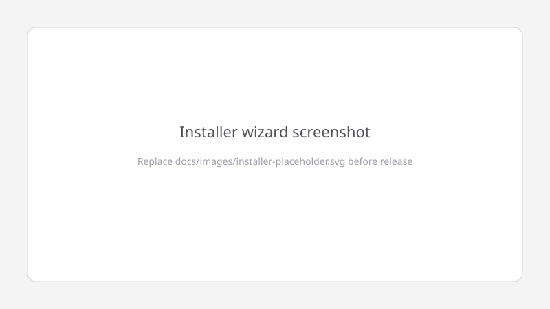
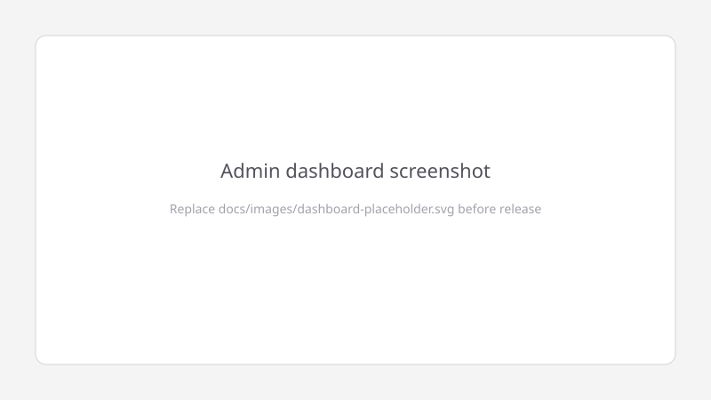

# FormFlow

**Self-hosted form backend for shared hosting.** Build forms, collect submissions, and manage your inbox — no SaaS fees, no Composer, no Node build step. Upload to any PHP + MySQL host and run the install wizard in under 10 minutes.

[](LICENSE)
[](https://www.php.net/)

---

## Screenshots

> Replace these placeholders with real assets before publishing the GitHub release.

| Installer wizard | Admin dashboard |
|------------------|-----------------|
|  |  |
| *6-step setup: requirements → database → SMTP → admin → settings → done* | *Forms, submissions chart, recent activity* |

<!-- GIF: docs/images/install-demo.gif — optional screen recording of full install -->

---

## Deploy in under 10 minutes

### 1. Get the code

- **GitHub release:** download `formflow-1.0.0.zip` from [Releases](https://github.com/YOUR_ORG/formflow/releases) and extract it, **or**
- **Git:** `git clone https://github.com/YOUR_ORG/formflow.git`

### 2. Upload to your host

Upload the extracted folder to your web root via **FTP** (FileZilla, etc.) or **cPanel / hPanel File Manager**:

- Typical paths: `public_html/`, `public_html/formflow/`, or a subdomain folder
- Ensure `index.php`, `.htaccess`, and `install/` are in the document root you will browse to

### 3. Create a MySQL database

In your hosting control panel (cPanel → MySQL®, hPanel → Databases):

1. Create a new database (e.g. `u123456_formflow`)
2. Create a database user with a strong password
3. Grant the user **ALL PRIVILEGES** on that database
4. Note **host** (often `localhost`), **database name**, **username**, and **password**

### 4. Run the installer

Visit:

```text
https://yourdomain.com/install/
```

Complete all six steps. The wizard writes `config.php`, runs migrations, and creates your admin account. When finished, you are redirected to **Sign in**.

### 5. Sign in and create your first form

- Dashboard: `/admin`
- New form: `/admin/forms/new` or pick a **Template**
- Embed code: form **Edit → Embed** tab
- Public endpoint: `POST /submit/{your-form-slug}`

**Verify the package locally before upload:**

```bash
php core/verify-release-package.php
```

---

## Requirements

| Requirement | Minimum | Recommended |
|-------------|---------|-------------|
| **PHP** | 7.4 | 8.1+ |
| **MySQL** | 5.7 | 8.0+ |
| **MariaDB** | 10.3 | 10.6+ |
| **Web server** | Apache with `mod_rewrite` | Apache or LiteSpeed |
| **HTTPS** | Optional | Recommended (session cookies) |

### Required PHP extensions

| Extension | Purpose |
|-----------|---------|
| `pdo_mysql` | Database |
| `mbstring` | Unicode / validation |
| `openssl` | Encryption, tokens |
| `curl` | reCAPTCHA, webhooks |
| `gd` | Installer requirements check |

**Writable paths:** project root (for `config.php`) and `/uploads/`.

---

## Local development

```bash
php -S localhost:8000 router.php
```

Open [http://localhost:8000/install/](http://localhost:8000/install/) — no `config.php` needed. See [CONTRIBUTING.md](CONTRIBUTING.md) for coding standards and PR checklist.

---

## FAQ

### Does FormFlow work on shared hosting?

**Yes.** FormFlow is designed for classic shared PHP hosting (cPanel, hPanel, Plesk). There is no Composer install, no long-running processes, and no Redis requirement. You need PHP 7.4+, MySQL/MariaDB, and Apache `mod_rewrite` (or equivalent rewrite rules).

### Hostinger-specific notes

- **PHP version:** hPanel → **Advanced → PHP Configuration** — select **PHP 8.1** or **8.2**
- **Database:** hPanel → **Databases → MySQL Databases** — create DB + user; host is usually `localhost`
- **Upload:** File Manager → `public_html` — upload the ZIP and extract
- **Document root:** For a subdomain, point the subdomain folder to where `index.php` lives
- **HTTPS:** Enable **SSL** in hPanel (Let’s Encrypt) and set `app.session_secure` to `true` in Settings after install
- **`.htaccess`:** Hostinger Apache supports it by default; if URLs 404, confirm `mod_rewrite` is on

Help others by filing a **[Hosting compatibility report](.github/ISSUE_TEMPLATE/hosting_compatibility_report.md)** issue.

### Can I use nginx?

Yes, with rewrite rules equivalent to `.htaccess` (route requests to `index.php`, deny `/core`, `/includes`, `/uploads`, `config.php`). Apache examples ship in the repo.

### Is there a public signup page?

No. The first admin is created in the installer. Additional users are invite-only (invite flow coming in a future release).

### Where are uploads stored?

Files land in `/uploads/{form_id}/` with random names. They are **not** web-accessible; downloads require admin authentication.

### How do I embed a form?

See the **Embed** tab on any form, or the examples in this README under [Public Form Submission API](#public-form-submission-api).

---

## Security

- [SECURITY.md](SECURITY.md) — authentication, sessions, CSRF, rate limits
- [SECURITY_AUDIT.md](SECURITY_AUDIT.md) — hardening audit (Phases 0–5) and automated tests

```bash
php core/run-security-audit.php https://yourdomain.com
```

**Production:** set `app.debug` to `false` and `app.env` to `production` in Settings or `config.php`.

---

## Public Form Submission API

`POST /submit/{form_slug_or_id}` — accepts HTML form posts and JSON. CORS is controlled per form (**Allowed domains** in form settings).

### Plain HTML

```html
<form action="https://yourdomain.com/submit/contact-us" method="POST">
  <label>Full Name <input type="text" name="f_name" required></label>
  <label>Email <input type="email" name="f_email" required></label>
  <label>Message <textarea name="f_message" required></textarea></label>
  <div style="display:none" aria-hidden="true">
    <label>Leave blank<input type="text" name="_honeypot" tabindex="-1" autocomplete="off"></label>
  </div>
  <button type="submit">Send</button>
</form>
```

### JavaScript `fetch()`

```javascript
fetch('https://yourdomain.com/submit/contact-us', {
  method: 'POST',
  headers: { 'Content-Type': 'application/json', 'Accept': 'application/json' },
  body: JSON.stringify({
    f_name: 'Jane Doe',
    f_email: 'jane@example.com',
    f_message: 'Hello from fetch()',
  }),
}).then((r) => r.json()).then(console.log);
```

| Situation | Classic POST | JSON |
|-----------|--------------|------|
| Validation failed | Redirect to referer | `422` + field errors |
| Rate limited | `429` | `429` |
| Origin blocked | `403` | `403` |

---

## Project structure

```
formflow/
├── index.php              # Front controller
├── router.php             # PHP built-in server router
├── install/               # Installer wizard
├── core/                  # Application code
├── views/                 # Page templates
├── templates/             # Layouts
├── includes/PHPMailer/    # Vendored mailer
├── uploads/               # Private file storage
├── LICENSE
├── CHANGELOG.md
├── SECURITY.md
└── SECURITY_AUDIT.md
```

---

## Changelog

See [CHANGELOG.md](CHANGELOG.md). Current release: **v1.0.0**.

---

## Contributing

Contributions welcome! Read [CONTRIBUTING.md](CONTRIBUTING.md) for PSR-12 style, local setup, and the security PR checklist.

---

## License

[MIT](LICENSE) © FormFlow Contributors
